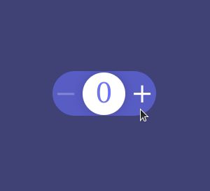
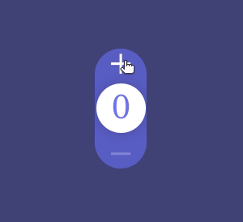

# vue-stepper-touch
***
### Stepper Touch for Vue 3 based on a Dribbble showcase designed by [Oleg Frolov](https://dribbble.com/shots/3368130-Stepper-Touch) and coded in vanilla JavaScript by [Marvin Rudolph](https://codepen.io/MarvinRudolph/pen/aQBpEg)

***
### Horizontal view



### Vertical view


## Installation
***
##### Install the component into your repo/app
> npm i vue-stepper-touch

##### Import component in your template
> import VueStepperTouch from 'vue-stepper-touch'

## Usage
***

```
<VueStepperTouch
    class="m-1 px-3 border border-collapse border-black-900 text-center"
    axis="x"
    background="#6d72fe"
    color="#ffffff"
    fontFamily="Poppins"
    :opacity=25
    :min=0
    :max=100
    :initialValue=0
    :size=4
    @valueChange="changeValue"
/>
```
### Props configuration
| Prop           | Type      | Description |
| -----------    | --------- | ----------- |
| class          | String    | add any css class you prefer for the component formating, it supports tailwind.css                                       |
| axis           | String    | the axis direction of the component, can take `x` for horizontal or `y` for vertical rendering                           |
| background     | String    | the hex colour code for the background of the element e.g. `#ffffff`                                                     |
| color          | String    | the hex colour code for the indicator and the plus minus parts e.g. `#333333`                                            |
| fontFamily     | String    | the font type of the numeric indicator value e.g. `Arial`                                                                |
| opacity        | Number    | the alpha opacity color that applies on the stepper element as background based on `color` can take values from 0 to 100 |
| min            | Number    | the minimum value that the counter can take                                                                              |
| max            | Number    | the maximum value that the counter can take                                                                              |
| initialValue   | Number    | the initial value that the counter will take on first load                                                               |
| size           | Number    | the size of the stepper element in `rem`'s <strong>e.g. :</strong> `3.5` or `3`                                                              |
| @valueChange   | Callback  | event listener with a callback function that accepts a payload as parameter which includes the changed `value` <br /> <strong>e.g. :</strong> a method like : ``changeValue(payload) { return payload.value }``|